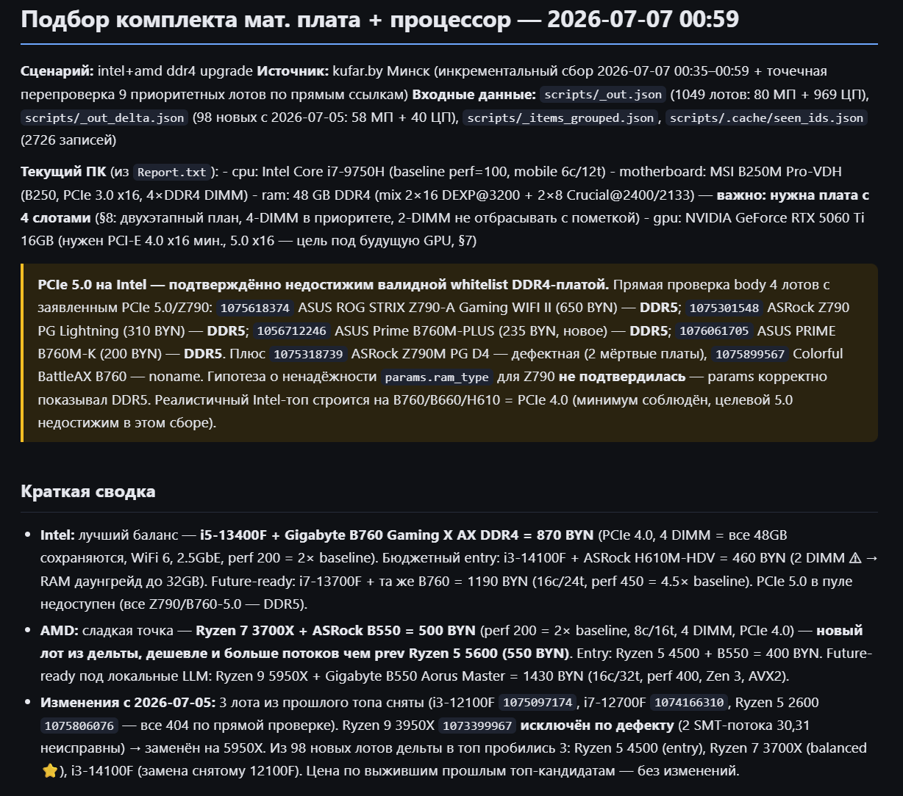
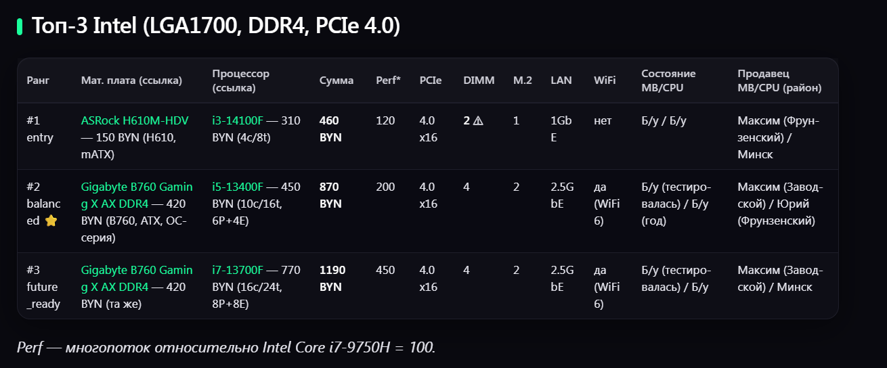
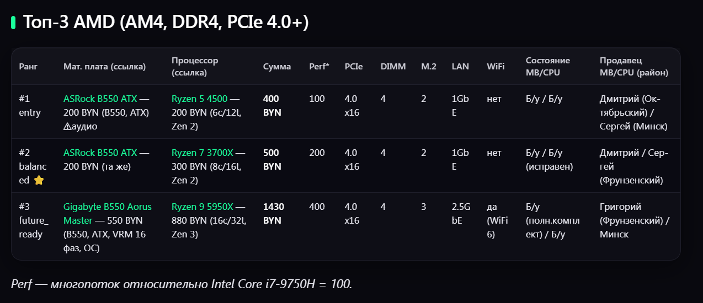

# kufar-upgrade-assistant

Агент-оркестратор подбора б/у комплектующих (материнская плата + процессор) на kufar.by для модернизации домашнего ПК. Собирает объявления, фильтрует по совместимости, ранжирует топ-3 комплекта для Intel и AMD, сохраняет отчёт с прямыми ссылками.

## Проблема

Пользователь модернизирует ПК с минимальными затратами, покупая комплектующие б/у. Подбор совместимой пары «плата + процессор» вручную — рутина: нужно сверять сокет, поколение CPU, чипсет, тип памяти, PCIe-шину, отсеивать noname, бракованные лоты и договорные цены, а затем сравнивать сотни объявлений. Агент автоматизирует этот процесс.

## Для кого

Домашние пользователи ПК, которые хотят недорого обновить платформу и CPU, особенно под задачи с высокими требованиями к PCIe-шине — например, под современную видеокарту и локальные LLM-модели.

## Основная функция

1. Читает два входных файла: текущую конфигурацию ПК и требования к апгрейду.
2. Собирает актуальные объявления с kufar.by по заданным категориям и региону.
3. Фильтрует лоты по жёстким ограничениям: DDR4, PCIe ≥ 4.0, whitelist-бренды, без дефектов, с числовой ценой.
4. Комбинирует материнские платы и процессоры из разных объявлений, проверяя совместимость сокет + поколение + чипсет.
5. Ранжирует топ-3 для Intel и топ-3 для AMD по трём тирам: entry, balanced, future_ready.
6. Сохраняет отчёт в Markdown + JSON/CSV с ценами, состоянием, ссылками и заметками.
7. При необходимости перепроверяет цены и статус сохранённых лотов по прямым ссылкам.

## Формат результата

- Markdown-отчёт: сводка, топ-3 Intel, топ-3 AMD, сравнительная таблица, исключённые лоты, открытые вопросы.
- JSON: структурированные данные топ-пар и метаданные прогона.
- CSV: плоская выгрузка комплектов для импорта в таблицу.

## Минимальный функционал (MVP)

- Подбор Intel LGA1700 + DDR4 + PCIe 4.0/5.0.
- Подбор AMD AM4 + DDR4 + PCIe 4.0.
- Фильтрация по брендам, дефектам, цене, региону Минск.
- Топ-3 по каждой платформе с ссылками и суммой комплекта.
- Проверка актуальности прошлых отчётов по прямым ссылкам.

## Технологии

- Python 3 — скрипты конвейера.
- `requests` + `urllib` — сбор страниц kufar.by.
- Claude Code + кастомные агенты (`kufar-listings-fetcher`, `kit-analyzer`) — оркестрация, фильтрация, ранжирование.
- Markdown + JSON + CSV — форматы отчётов.
- GitHub — публикация кода и скилла.

## Структура репозитория

```
.
├── CLAUDE.md                         # инструкции главному агенту
├── Report.txt                        # текущая конфигурация ПК (вход)
├── апгрейд-пк — пожелания.md         # параметры апгрейда (вход)
├── проект — документация.md          # полная документация по устройству проекта
├── README.md                         # этот файл
├── .gitignore
├── .claude/
│   ├── agents/                       # определения субагентов
│   │   ├── kit-analyzer.md
│   │   └── kufar-listings-fetcher.md
│   ├── skills/                     # Claude Code skills
│   │   ├── kufar-upgrade/SKILL.md
│   │   └── kufar-refresh/SKILL.md
│   └── agent-memory/               # память субагентов
├── scripts/                          # конвейер сбора и ранжирования
│   ├── kufar_parse.py              # сбор листингов
│   ├── kufar_details.py            # детали объявлений
│   ├── kufar_filter.py             # фильтр по совместимости
│   ├── _build_report.py            # построение топ-3 отчёта
│   ├── kit_analyzer_run.py         # альтернативный ранжировщик
│   ├── reprocess_kits.py           # переранжирование
│   ├── enrich_seen.py              # обогащение seen_ids.json
│   ├── transform_for_delivery.py   # плоская схема выгрузки
│   └── md_to_html.py               # .md → .html
├── reports/                          # сохранённые отчёты
└── scripts/.cache/                 # кеш объявлений (не в git)
```

## Как запустить

1. Установите зависимости Python:
   ```bash
   pip install requests beautifulsoup4 lxml markdown
   ```

2. Заполните входные файлы:
   - `Report.txt` — конфигурация текущего ПК (CPU, плата, ОЗУ, GPU).
   - `апгрейд-пк — пожелания.md` — параметры апгрейда (регион, бюджет, тиры, приоритеты).

3. Запустите конвейер в Claude Code:
   ```
   /kufar-upgrade both
   ```
   Или пошагово:
   ```bash
   cd scripts
   python kufar_parse.py "https://www.kufar.by/l/r~minsk/materinskie-platy" "https://www.kufar.by/l/r~minsk/processory" --full
   python kufar_details.py
   python kufar_filter.py
   python _build_report.py
   ```

4. Готовые отчёты появятся в `reports/`.

## Пример результата

См. последний отчёт: [`reports/2026-07-07 0059 — intel+amd ddr4 upgrade — подбор.md`](reports/2026-07-07%200059%20—%20intel+amd%20ddr4%20upgrade%20—%20подбор.md)

Краткая сводка из отчёта 2026-07-07:

- **Intel:** лучший баланс — i5-13400F + Gigabyte B760 Gaming X AX DDR4 = 870 BYN (PCIe 4.0, 4 DIMM, perf 200).
- **AMD:** лучший perf/price — Ryzen 7 3700X + ASRock B550 = 500 BYN (PCIe 4.0, 4 DIMM, perf 200).
- В пуле DDR4 отсутствуют валидные PCIe 5.0 платы из whitelist-брендов; максимум — PCIe 4.0 x16.

## Скриншоты





*(Скриншоты размещены в папке `images/` репозитория.)*

## Скилл проекта

В репозитории есть Claude Code skill — `.claude/skills/kufar-upgrade/SKILL.md`. Он позволяет повторить проект в другом окружении: понять структуру, запустить конвейер, обновить README и подготовить отчёт.

## Границы и безопасность

- Проект только читает объявления kufar.by — не отправляет сообщения продавцам.
- Не удаляет файлы без явного одобрения пользователя.
- Не выходит за пределы рабочей папки.

## Лицензия

MIT — свободное использование и доработка.
